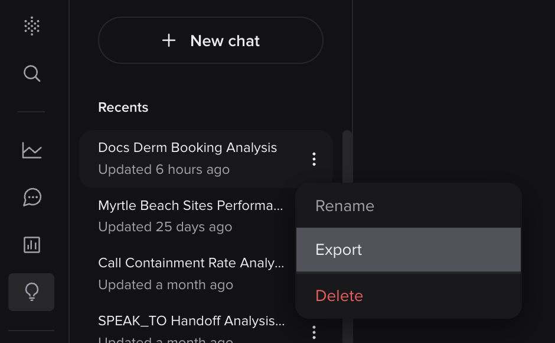
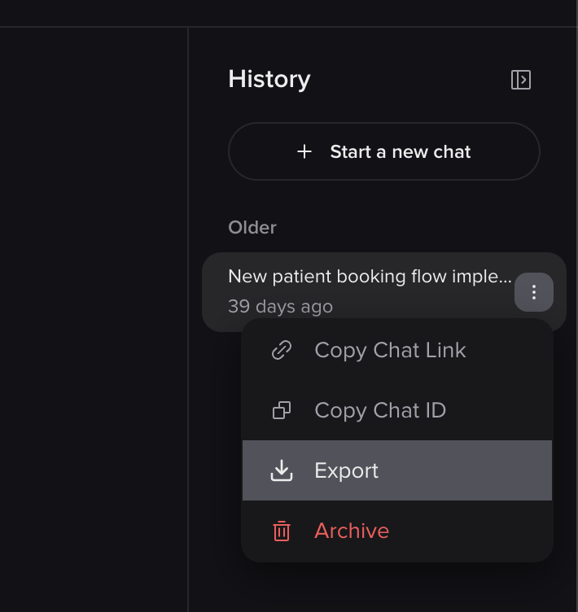
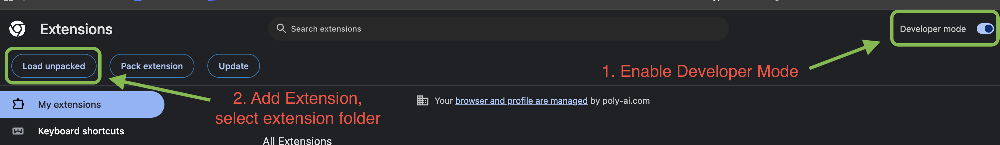

#  Analyst & Assistant Export

A Chrome extension that adds an **Export** button to PolyAI **Smart Analyst** and **Studio Assistant** chat history. Export conversations as styled HTML or downloadable PDF — with tables, charts, and PolyAI branding. Everything runs locally in your browser. No data is uploaded or shared.

## Features

### One-Click Export

#### Smart Analyst
Click the three-dot menu on the **active** Smart Analyst chat and select **Export**. A styled preview opens in a new tab.

> The Export option only appears for the chat you're currently viewing.

<p align="center">
  
</p>

#### Studio Assistant
Click the three-dot menu on any chat in the Studio Assistant **History** sidebar and select **Export**.

<p align="center">
  
</p>

### Styled Preview
The preview renders the full conversation with PolyAI branding — tables, charts, headings, lists, bold/italic, and inline code. Toggle between dark and light mode with the toolbar button.

<p align="center">
  
</p>

### Save as PDF
Click **Save PDF** in the preview toolbar to generate a downloadable PDF with selectable text, proper page breaks, styled tables, and embedded charts. Powered by [pdfmake](https://github.com/bpampuch/pdfmake) — runs entirely client-side.

### Save as HTML
Click **Save HTML** to download a self-contained `.html` file. The downloaded file includes formatting tips for saving as PDF or pasting into Word/Google Docs.

<p align="center">
  
</p>

### Chart Rendering
Smart Analyst chart data (stored as JSON) is rendered as SVG visualizations:
- **Line charts** for time-series data (dates on x-axis)
- **Bar charts** for categorical data (e.g., handoff reasons)
- Auto-detected axis formatting (percentages vs. raw numbers)
- Rotated labels for long category names

### Dark / Light Mode
The preview toolbar includes a theme toggle. Light mode is optimized for printing and copy-paste into documents. The saved HTML file always exports in light mode for compatibility.

## Supported Chat Types

| Source | What's exported | How to trigger |
|--------|----------------|----------------|
| **Smart Analyst** | User prompts + assistant responses (markdown with tables/charts) | Three-dot menu on the active chat in the Smart Analyst sidebar |
| **Studio Assistant** | User prompts + assistant responses (rendered HTML including plans, code, and rich formatting) | Three-dot menu on any chat in the Studio Assistant History sidebar |

## Privacy

This extension is designed so that **no chat data ever leaves your machine**:

- The extension has **zero permissions** — no storage, no tabs, no network access
- The preview opens in a local blob URL that cannot be shared
- PDF generation runs entirely client-side via bundled libraries (no CDN, no server)
- The extension reads chat content from the existing page DOM — it makes no API calls
- A `beforeunload` warning prevents accidental data loss from refreshing the preview

## Installation

### 1. Clone the repository

```bash
git clone https://github.com/PatrickSwanson-Poly/AnalystAssistantExport.git
```

### 2. Load the extension

Navigate to `chrome://extensions` in Google Chrome. Enable **Developer mode** (top-right toggle), then click **Load unpacked** (top-left) and select your local `AnalystExport` folder.

<p align="center">
  
</p>

You should now see **Analyst & Assistant Export** in your extensions list.

### 3. Use it

#### Smart Analyst
1. Open any project's **Smart Analyst** page in Agent Studio
2. Open the chat you want to export
3. Click the **three-dot menu** (⋮) on that chat in the sidebar
4. Click **Export**
5. A new tab opens with the styled preview
6. Click **Save PDF** or **Save HTML** from the toolbar

#### Studio Assistant
1. Open any project's **Studio Assistant** page in Agent Studio
2. Open the conversation you want to export
3. Click the **three-dot menu** (⋮) on that conversation in the History sidebar
4. Click **Export**
5. A new tab opens with the styled preview
6. Click **Save PDF** or **Save HTML** from the toolbar

The extension works on all Agent Studio URLs including `studio.us.poly.ai`, `studio.eu.poly.ai`, and `*.polyai.app` (Jupiter).

## Updating

```bash
cd AnalystExport
git pull
```

Then click the reload icon on the Analyst & Assistant Export card in `chrome://extensions` and refresh any open Agent Studio tabs.

## File Structure

```
AnalystExport/
  manifest.json               # Extension manifest (MV3)
  content.js                  # Content script — DOM extraction, markdown-to-HTML, export UI
  pdfmake.min.js              # Bundled pdfmake for client-side PDF generation
  vfs_fonts.js                # Embedded Roboto font for PDF rendering
  pdf-builder.js              # Markdown-to-pdfmake document definition transformer
  icons/
    analystexport_16.png      # Toolbar icon
    analystexport_48.png      # Extensions page icon
    analystexport_128.png     # Chrome Web Store icon
    analystexport_16bw.png    # Greyscale variant
    analystexport_48bw.png    # Greyscale variant
    analystexport_128bw.png   # Greyscale variant
  support/
    DevMode_LoadExt.png                  # Installation guide screenshot
    Export_Location.png                  # Smart Analyst export button screenshot
    Export_StudioAssistant_Location.png  # Studio Assistant export button screenshot
    Export_Webpage_Preview.png           # Dark mode preview screenshot
    Export_HTML_Preview.png              # Saved HTML file screenshot
```

## Author

**Patrick Swanson** — PolyAI
